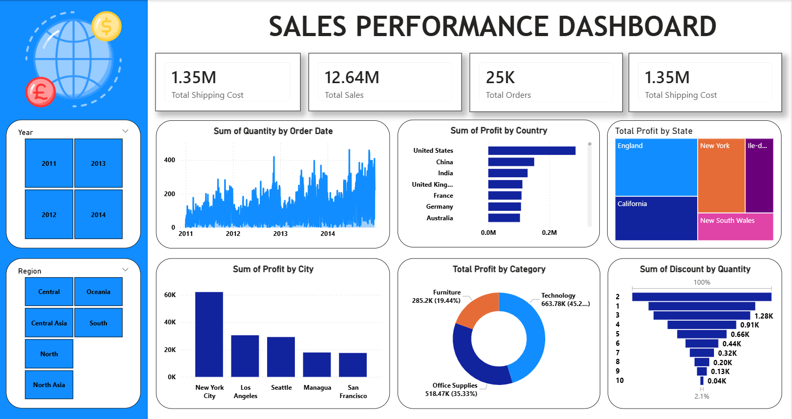

# 📊 Global Sales Performance Dashboard — Power BI Project



---

## 🗂️ Repository Structure

```
📁 Global-Sales-PowerBI/
├── 📄 README.md                  ← You are here!
├── 📊 Global_Sales.pbix          ← Power BI Dashboard File
├── 📂 Global Superstore.xls      ← Source Data (Excel)
└── 🖼️ UI.png                     ← Dashboard Screenshot
```

---

## 🌟 Project Overview

This **Power BI Sales Performance Dashboard** provides a comprehensive, interactive view of global sales data from the **Global Superstore** dataset. It enables stakeholders to analyze sales trends, profitability by geography, and category-level performance — all from a single, dynamic dashboard.

---

## 📈 Key Metrics at a Glance

| Metric | Value |
|---|---|
| 💰 Total Sales | **$12.64M** |
| 📦 Total Orders | **25K** |
| 🚢 Total Shipping Cost | **$1.35M** |

---

## 🔍 Dashboard Features

### 📅 Sum of Quantity by Order Date
- A **time-series area chart** showing order quantity trends from **2011 to 2014**
- Clearly captures **seasonal spikes** and growth patterns over the years

### 🌍 Sum of Profit by Country
- **Horizontal bar chart** comparing profits across top countries
- **United States** leads, followed by **China**, **India**, **United Kingdom**, **France**, **Germany**, and **Australia**

### 🗺️ Total Profit by State (Treemap)
- Visual breakdown of profit contribution by state/region
- Top performers: **England**, **California**, **New York**, **Île-de-France**, **New South Wales**

### 🏙️ Sum of Profit by City
- **Bar chart** ranking the most profitable cities
- **New York City** tops the list, followed by **Los Angeles**, **Seattle**, **Managua**, and **San Francisco**

### 🛍️ Total Profit by Category (Donut Chart)
- **Technology**: 663.78K *(45.23%)*
- **Office Supplies**: 518.47K *(35.33%)*
- **Furniture**: 285.2K *(19.44%)*

### 🎯 Sum of Discount by Quantity
- **Bar chart** showing the relationship between discount levels and order quantities
- Helps identify discount strategies and their impact on volume

### 🌐 Region Filter (Slicer)
- Interactive region slicer with options:
  - **Central**, **North Asia**, **Central Asia**, **Oceania**, **North**, **South**

---

## 🛠️ Tools & Technologies

| Tool | Purpose |
|---|---|
| 🟡 Microsoft Power BI Desktop | Dashboard creation & visualization |
| 📗 Microsoft Excel (.xls) | Source data storage |
| 📊 Global Superstore Dataset | Business sales data |

---

## 📂 Data Source

The dashboard is powered by the **Global Superstore** dataset (`Global Superstore.xls`), which includes:
- Order details (Date, Region, Country, City, State)
- Product categories (Furniture, Technology, Office Supplies)
- Financial data (Sales, Profit, Discount, Shipping Cost)
- Customer and order quantity information

---

## 🚀 How to Use

1. **Clone or download** this repository
2. Open **`Global_Sales.pbix`** in [Power BI Desktop](https://powerbi.microsoft.com/desktop/)
3. If prompted, **refresh the data source** and point it to `Global Superstore.xls`
4. Use the **Region slicer** on the left to filter the entire dashboard by region
5. Interact with any visual to **cross-filter** the rest of the dashboard

---

## 📋 Requirements

- [Power BI Desktop](https://powerbi.microsoft.com/desktop/) *(Free)*
- Microsoft Excel or compatible viewer for the `.xls` data file

---

## 👤 Author

> Built with 💙 using Power BI — transforming raw data into actionable insights!

---

## 📝 License

This project is intended for educational and portfolio purposes.  
Dataset: Global Superstore (publicly available sample dataset).
